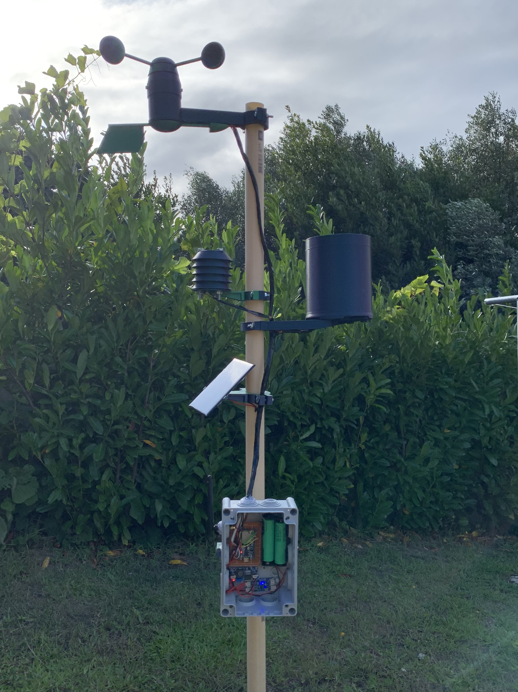

# Rust Weather Station

<div align="center">
  
</div>

---
This repository contains the firmware for a solar-powered weather station based on an ESP32. The software is implemented entirely in Rust using the `esp-hal` hardware abstraction layer and the `embassy` async ecosystem. Sensor data is collected concurrently, published over MQTT, and the device returns to deep sleep to preserve the battery between sampling windows.

## Hardware overview

The firmware targets the following hardware stack:

- ESP32 module serving as the main controller.
- AS5600 magnetic rotary sensor that tracks wind direction.
- DHT22 digital temperature and humidity sensor connected on a single data line.
- Anemometer and tipping-bucket rain gauge driven by hall-effect sensors.
- INA219 current and voltage monitor for battery telemetry.
- 18650 Li-ion battery with a CN3791-based charge controller and a 12 V solar panel.

The enclosure, mast adapters, and sensor mounts are designed for 3D printing. STL files are available on Printables: [YAWS (Yet Another Weather Station)](https://www.printables.com/model/729382-yaws-yet-another-weather-station/files).

## Software architecture

### Async task layout

The application runs under `esp-rtos` with the `embassy` executor:

- `wifi_task` brings up the Wi-Fi station interface and keeps the radio connected.
- `mqtt_task` drains a multi-producer queue and publishes each payload to the configured MQTT broker using the `rust-mqtt` client.
- `dht_task`, `anemo_task`, `as5600_task`, and `ina210_task` (INA219) sample their respective sensors and push structured readings onto the shared MQTT channel.
- Interrupt-driven peripherals (the anemometer and rain gauge) use debounce logic to ensure clean counts, while the AS5600 task averages multiple I2C readings to derive wind direction and cardinal labels.

Shared resources, such as the I2C bus, are coordinated through `embassy-embedded-hal` mutexes so multiple async tasks can safely communicate with their devices.

### Power management and scheduling

The main task supervises all worker tasks for a configurable active window, feeds the watchdog, and then disconnects nonessential peripherals before putting the ESP32 into deep sleep. Wakeups occur either on the deep-sleep timer or on the external interrupt used for the rain gauge, which allows single tips to be published immediately.

## Configuration

Compile-time configuration values (Wi-Fi credentials, MQTT broker details, task durations, and channel sizes) are defined in `src/config.rs` through the `toml-cfg` macro. Provide a `cfg.toml` file in the project root with entries such as:

```toml
[default]
ssid = "your-ssid"
wifi_pass = "your-password"
broker_ip = "192.168.1.10"
broker_port = 1883
mqtt_user = "station"
mqtt_pass = "secret"
topic = "weather_station"
```

Adjust `deep_sleep_dur_secs`, `main_task_dur_secs`, and `task_dur_secs` to control how long the station stays awake, how often readings are taken, and how frequently MQTT packets are sent.

## Building and flashing

1. Install the ESP32 Rust toolchain specified in `rust-toolchain.toml` and ensure you have `cargo-espflash` available.
2. Connect the ESP32 over USB and place it into bootloader mode (usually by holding BOOT while pressing EN).
3. Build and flash the firmware:

   ```bash
   cargo espflash flash --release /dev/ttyUSB0
   ```

   Replace the serial port path with the one that matches your workstation.

After flashing, the station will connect to the configured Wi-Fi network, stream sensor values to the MQTT broker, and fall back to deep sleep between sampling intervals.

## Thread-to-thread queue example

For a smaller example demonstrating the same queueing pattern between tasks, see `examples/dht_mqtt_queue.rs`. It shows how a sensor sampling task can push readings into a FreeRTOS queue that an MQTT publisher drains using `esp-idf-svc` primitives.
